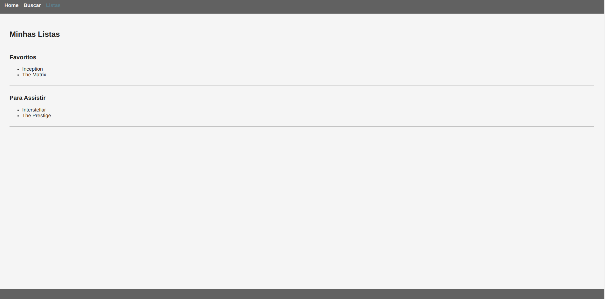

# Definição de Projeto
A aplicação consistirá em uma plataforma onde os usuários podem buscar filmes por características, como gênero, criar listas personalizadas e marcar filmes como assistidos, além de indicar se gostaram ou não de determinado filme. Também contará com um “escolhedor de filme aleatório”, para ajudar o usuário a conhecer novos filmes. Esse “escolhedor” poderá ser customizado com algumas características que mais se adequam ao gosto do consumidor final.

## Definição de Escopo e Objetivos
O objetivo principal é desenvolver uma aplicação web que permita aos usuários explorar filmes e organizar suas preferências de forma personalizada, facilitando também a descoberta de novos gêneros e títulos.

### As funcionalidades incluem:
- Busca por filmes por gênero
- Criação de listas personalizadas
- Marcação de filmes assistidos
- Escolhedor automático de filmes
- Avaliação de filmes

## Gestão Ágil do Projeto
O trabalho será organizado seguindo o framework Agile Scrum, com sprints definidos para cobrir diferentes fases do desenvolvimento: design, integração de APIs, implementação de funcionalidades e testes. As tarefas serão divididas em backlog, e o cronograma inicial inclui três sprints de uma semana, com entregas parciais ao final de cada sprint.

## Cronograma dos Eventos do Scrum

### Sprint 1: Design e Prototipação
- **Início:** 25/09/2024
- **Término:** 28/09/2024
- **Sprint Planning:** 24/09/2024
- **Daily Standups:** Diariamente (2-5 minutos cada)
- **Sprint Review:** 29/09/2024
- **Sprint Retrospective:** 30/09/2024

### Sprint 2: Integração de API e Funcionalidades
- **Início:** 08/10/2024
- **Término:** 14/10/2024
- **Sprint Planning:** 08/10/2024
- **Daily Standups:** Diariamente
- **Sprint Review:** 14/10/2024
- **Sprint Retrospective:** 15/10/2024

### Sprint 3: Testes e Ajustes Finais
- **Início:** 15/10/2024
- **Término:** 21/10/2024
- **Sprint Planning:** 15/10/2024
- **Daily Standups:** Diariamente
- **Sprint Review:** 21/10/2024
- **Sprint Retrospective:** 22/10/2024

## Artefatos, Papéis e Eventos do Scrum

### Artefatos
- **Product Backlog:** Lista priorizada de todas as funcionalidades e melhorias desejadas para o projeto.
- **Sprint Backlog:** Conjunto de itens do Product Backlog selecionados para a sprint atual.
- **Increment:** Produto potencialmente utilizável ao final de cada sprint.

### Papéis
- **Product Owner, Scrum Master e Developer:** Esses papéis serão desempenhados por um único integrante, adaptando-se ao número de membros do projeto.

### Eventos
- **Sprint Planning:** Definir as histórias de usuário e as tarefas da sprint.
- **Daily Standups:** Reuniões diárias rápidas para sincronização da equipe.
- **Sprint Review:** Apresentar as funcionalidades desenvolvidas e obter feedback.
- **Sprint Retrospective:** Discutir o que funcionou bem e o que pode ser melhorado.

## Produtos de Trabalho de Cada Evento
- **Sprint Planning:** Definição das histórias de usuário e tarefas para a sprint.
- **Daily Standups:** Atualizações diárias sobre o progresso e impedimentos.
- **Sprint Review:** Demonstração das funcionalidades concluídas.
- **Sprint Retrospective:** Lista de ações para melhorias no próximo ciclo.

## Criação de Histórias de Usuário

### Histórias de Usuário
- **História 1:** Como usuário, quero buscar filmes por gênero para encontrar facilmente filmes que me interessem.
- **História 2:** Como usuário, quero poder marcar filmes como assistidos e avaliá-los para acompanhar o que já vi e minha opinião sobre cada filme.
- **História 3:** Como usuário, quero personalizar o selecionador de filmes aleatórios para que ele recomende títulos mais alinhados com minhas preferências.

## Planejamento do Projeto de Desenvolvimento de Front-end
Os passos iniciais incluem a definição do layout e design responsivo, seguido pela integração da API de filmes e a implementação das funcionalidades principais. Marcos principais incluem a conclusão do design, a integração da API e o teste das funcionalidades.

Inicialmente, o foco será em definir os elementos visuais na tela, com o objetivo de torná-la intuitiva e prática tanto em dispositivos móveis quanto em desktop. O primeiro entregável da primeira sprint será a definição e prototipação dessas interfaces.

## Sprints e Funcionalidades Completas

### Sprint 1: Design e Prototipação
- **Funcionalidade:** Definição completa do layout e design responsivo.
- **Entregável:** Protótipos das interfaces para web e mobile.

### Sprint 2: Integração de API e Funcionalidades
- **Funcionalidades:**
    - Integração da API de filmes.
    - Implementação completa da funcionalidade de busca por gênero.
    - Implementar alteração de tema dark ou light.
    - Incremento da listagem de filmes, trazendo imagens e informações adicionais.
- **Entregável:** Funcionalidade de busca por gênero implementada e integrada.

### Sprint 3: Testes e Ajustes Finais
- **Funcionalidades:**
    - Implementação das listas personalizadas.
    - Marcação e avaliação de filmes.
    - Escolhedor aleatório customizável.
- **Entregável:** Todas as funcionalidades principais implementadas e testadas.

## Interatividade na Aplicação Web/Mobile

As interações básicas incluem:

- Busca por filmes
- Adição e remoção de filmes em listas
- Marcação de filmes como assistidos ou não
- Ferramenta de escolha aleatória/automática

A versão mobile incluirá gestos como deslizar para marcar um filme como assistido, avaliar ou escolher novamente um filme aleatório.

## Framework
ReactJS será utilizado para desenvolver a interface web, proporcionando uma experiência interativa e responsiva. React Native será empregado para a versão mobile, permitindo a reutilização de componentes e garantindo a consistência entre as plataformas, além de suportar gestos touch nativos.

A fase inicial será executada com os princípios de “mobile first” e se expandirá para adequar as funcionalidades em plataformas desktop.

## Resumo das Melhorias com Base no Feedback

- **Cronograma com Datas para os Eventos do Scrum:** Adicionamos um cronograma detalhado com datas específicas para Sprint Planning, Daily Standups, Sprint Review e Sprint Retrospective para cada sprint.
- **Produtos de Trabalho de Cada Evento:** Especificamos os produtos de trabalho gerados em cada evento do Scrum, como definição de tarefas durante o Sprint Planning e a apresentação das funcionalidades no Sprint Review.
- **Funcionalidades Implementadas por Completo:** Garantimos que cada sprint entregue funcionalidades completas, integrando front-end e back-end, como a implementação completa da busca por gênero na Sprint 2.
- **Sprints Guiadas por Cartões de História do Usuário:** Relacionamos cada sprint a histórias de usuário específicas, garantindo que as sprints sejam guiadas pelas necessidades definidas no Product Backlog.
- **Modelo para Cartões de História do Usuário:** Ajustamos as histórias de usuário para seguir o modelo padrão, deixando-as mais claras e alinhadas com as expectativas do Scrum.

## Changelog

### Sprint 1: Design e Prototipação
- Entrega do protótipo das principais páginas no desktop e no mobile.

#### Desktop:

- home

- busca

- listagem

#### Mobile:

- home

- busca

- listagem

